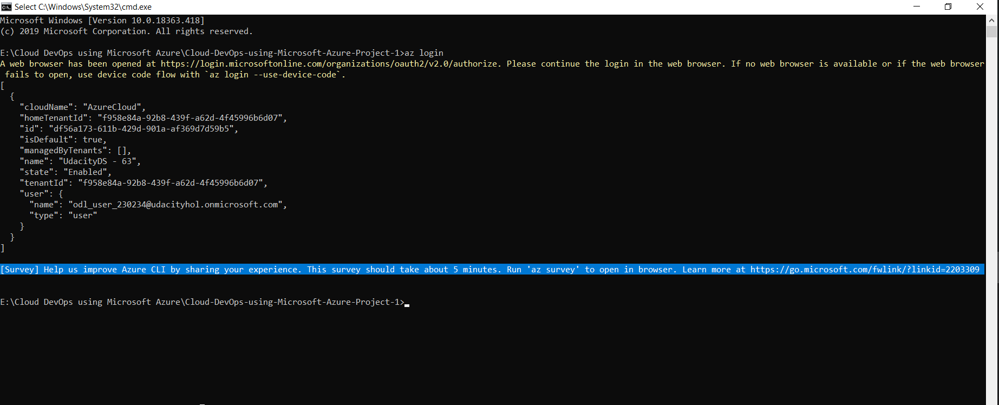

# Azure Infrastructure Operations Project: Deploying a scalable IaaS web server in Azure

### Introduction
For this project, you will write a Packer template and a Terraform template to deploy a customizable, scalable web server in Azure.

### Getting Started
1. Clone this repository

2. Create your infrastructure as code

3. Update this README to reflect how someone would use your code.

### Dependencies
1. Create an [Azure Account](https://portal.azure.com) 
2. Install the [Azure command line interface](https://docs.microsoft.com/en-us/cli/azure/install-azure-cli?view=azure-cli-latest)
3. Install [Packer](https://www.packer.io/downloads)
4. Install [Terraform](https://www.terraform.io/downloads.html)

### Instructions
#### Loin with Azure
- Run command to login with Azure ``` az login ``` , Then login in a web browser has been opened

#### Create and Apply a Tagging Policy
- Run command to define azure policy``` az policy definition create --name tagging-policy --rules .\TaggingPolicy.json  ```
- Run command to apply  azure policy``` az policy assignment create --policy tagging-policy  ```
- Run command to show azure policy assignment list ``` az policy assignment list ```

#### Create a Server Image
- File: server.json
- Run command to create packer image ``` packer build server.json ```

#### Terraform Template
1. Create the infrastructure with Terraform template
- File: main.tf => to declare the resource
- File: vars.tf => to declare variables

2. Initialize Terraform deployment
- Run command to initialize terraform deployment ``` terraform init ```

3. Terraform execution plan
- Run command to initialize a directory containing terraform ``` terraform plan [option] ```
- Run command to save the plan solution file ``` terraform plan -out solutions.plan ```. The -out parameter allows specifying of the output file and review of the plan

4. Apply a terraform plan
- Run command to apply a terraform plan ``` terraform apply solution.plan ``` or ``` terraform apply main.tf ```

#### How to customize vars.tf
This file contains all the variables used inside the terraform/main.tf. If you want to deploy on other servers, you need to change values default inside the file.
Example: 
```
  variable "server_names"{
  type = list
  default = ["<Server_1>","Server_2"]
}
```

### Output
Azure Login Output


Packer Build Output


Terraform Init Output


Terraform Plan Output


Terraform Apply Plan Output


Terraform will perform:


